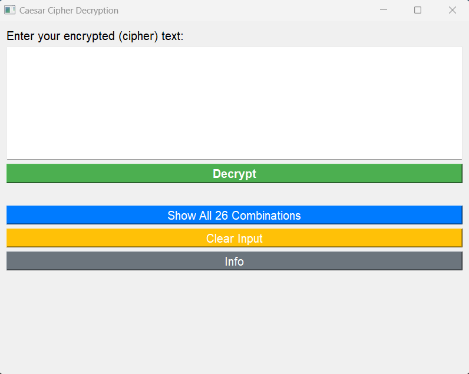
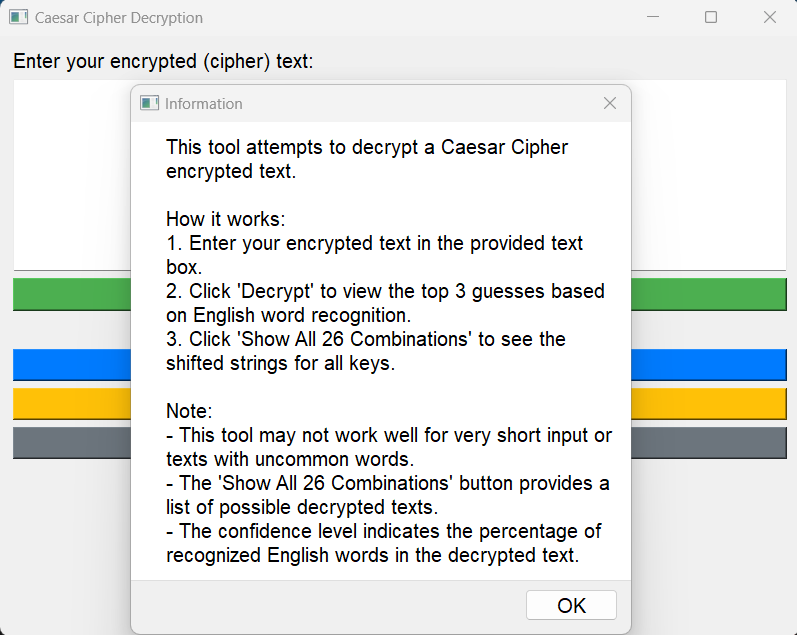
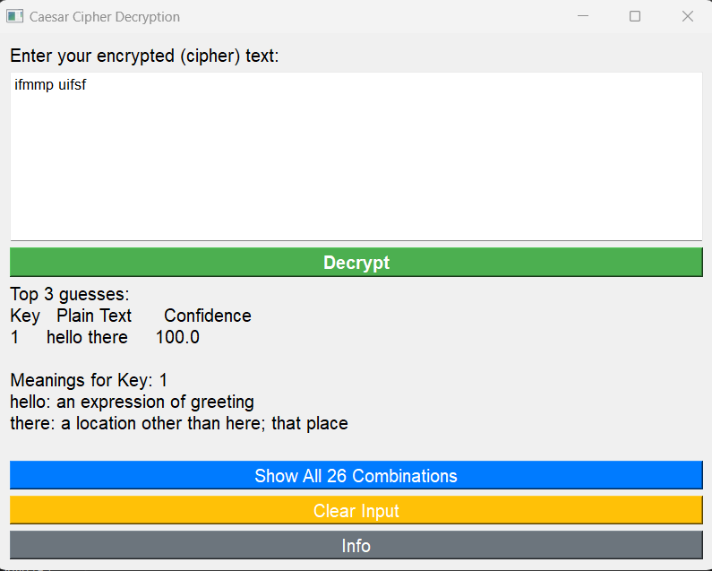
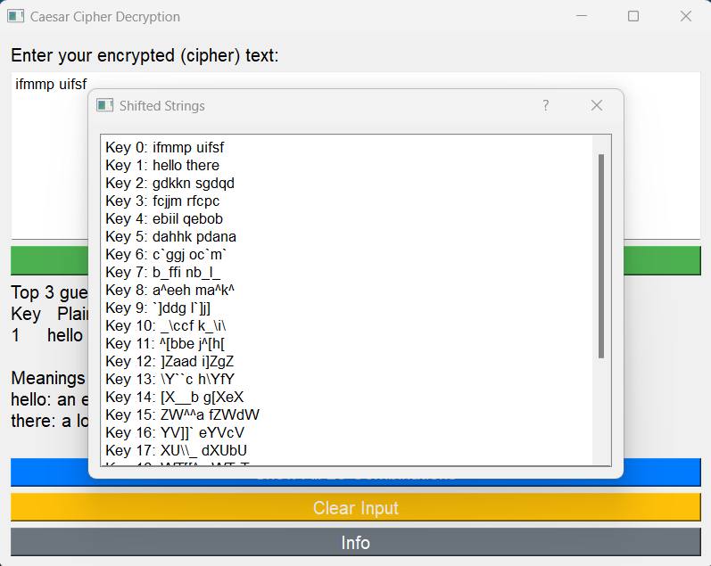

# silver-barnacle
## Automated Caesar-Cipher Decryption Tool
<br>

## Table of Contents

- [Description](#description)
- [Features](#features)
- [Installation](#installation)
- [Usage](#usage)
- [Screenshots](#screenshots)
- [Contributing](#contributing)
- [License](#license)

## Description

The Caesar Cipher Decryption Tool is a Python-based utility that helps decrypt text encrypted using the Caesar Cipher. It provides both a command-line interface (CLI) and a graphical user interface (GUI) for easy and efficient decryption.

## Features

- Decrypts text using the Caesar Cipher.
- Top 3 guesses for the decrypted text based on English word recognition.
- Shows all 26 combinations for in-depth analysis.
- Modern GUI design for user-friendly interaction.

## Installation

### CLI Version

1. Clone the repository:

    ```bash
    git clone https://github.com/Phaneesh-Katti/silver-barnacle.git
    cd silver-barnacle
    ```

2. Install the required dependencies:

    ```bash
    pip install -r requirements_cli.txt
    ```

### GUI Version

1. Clone the repository:

    ```bash
    git clone https://github.com/your-username/caesar-cipher-tool.git
    cd caesar-cipher-tool
    ```

2. Install the required dependencies:

    ```bash
    pip install -r requirements_gui.txt
    ```

## Usage

### CLI Version

Run the CLI tool by executing the following command:

```bash
python caesar_cipher_cli.py
```

## Screenshots

### GUI Version

<div align="center">
  
  <p><em>GUI Window</em></p>
</div>
<br><br>
<div align="center">
  
  <p><em>General info</em></p>
</div>
<br><br>
<div align="center">
  
  <p><em>Automatic Decryption Top Results</em></p>
</div>
<br><br>
<div align="center">
  
  <p><em>View All Decrypted Combinations</em></p>
</div>

